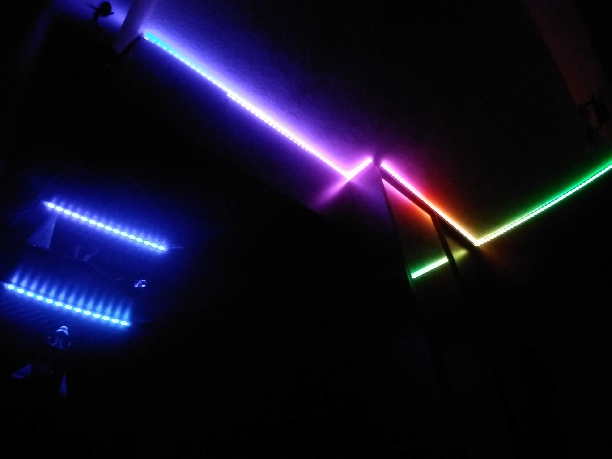

# PIR_LED_STRIP

Control board with PIR senzor, IR remote control and LED strip. LED strip contain addressable SK6812 RGBW LEDs. It is a board for corridor lighting when motion is detected

Animation

Color presentation

